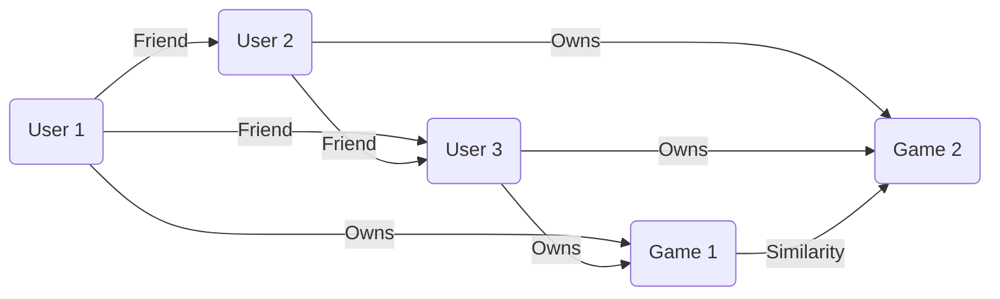
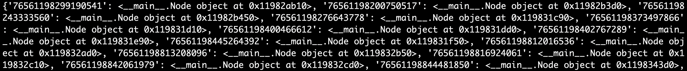
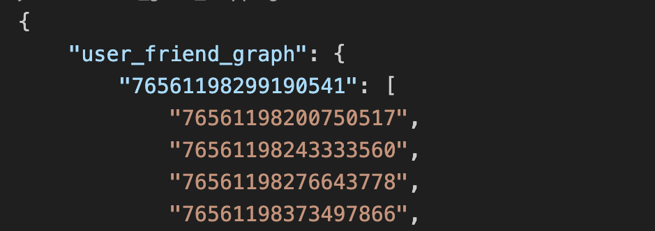

# SI507 Final Project Report - Game Recommendation System

Fangqing Lin 
Unique name: *lfqing*


## Project code

https://github.com/KathrynLin/SI507-FinalProject

The code is also included in the submission folder.

Python libraries are utilized for processing and analyzing gaming data from Steam. 

   - `numpy`, `json`, `os`, `requests`, `deque` (`from collections`), `re`.


## Data source

### Steam data
- **Origin:** Steam data is obtained using the Steam Web API (https://developer.valvesoftware.com/wiki/Steam_Web_API). Specifically, AppDetails is used to get detail description of an app, GetOwnedGames is used to get a list of games a user owns, and GetFriendList is used to get a list of friends of a user.

- **Format:** JSON

- **Cache:** Cache is used to store the owned games, the friends list, and the related games (games that his/her friends and friends of friends own). The cache is organised as a class in memory and a json file on disk:

  ```python
  class APICache:
      def __init__(self, cache_file='api_cache.json'):
          self.cache_file = cache_file
          self.data = self.load_cache()
  
      def load_cache(self):
          if os.path.exists(self.cache_file):
              with open(self.cache_file, 'r') as file:
                  return json.load(file)
          return {}
      
      def get(self, key):
          if key not in self.data:
              return None 
          else:
              return self.data[key]
  
  
      def set(self, key, value):
          self.data[key] = value
  
      def save_cache(self):
          with open(self.cache_file, 'w') as file:
              json.dump(self.data, file, indent=4)
  ```
  
  Caching is important because retrieving information with api is slow (1 second per access). By storing the retrieved information into the cache, no repeated api access is needed.
  
- **Data summary:** 

  - *# records available:* All games on Steam Store, over 50,000.
  - *# records retrieved:* The `related_games` field includes games of one's friends, friends of friends, friends of friends of friends, etc. Hence, the size of `related_games` depends on the depth one wants to discover. If depth is set to 2, number of related games is roughly 270.
  - *Description:* The `users` field in the cache file contains information specific to a user, including `owned_games`, `friends_list`, and `related_games`. The `apps` field containes detailed information of a game, with `name` the game name, `detailed_description` the description of the game, and `recommend` the number of recommendations.

### Twitch data

- **Origin:** Twitch data is obtained using the Twitch API (https://dev.twitch.tv/docs/api/). Specifically, `https://api.twitch.tv/helix` is used as the base API URL.
- **Format:** JSON
- **Cache:** Since twich streams are real-time, no cache is needed.
- **Data summary:** 
  - *# records available:* All games on Twitch, over 10,000.
  - *# records retrieved:* Same order as `related_games`, roughly 270.
  - *Description:* Each field is described as follows:
    - `user_name`: The username of the streamer.
    - `title`: The title or description of the stream.
    - `viewer_count`: The number of viewers currently watching the stream.
    - `language`: The language in which the stream is being broadcasted.
    - `started_at`: The timestamp indicating when the stream started.
    - `thumbnail_url`: The URL of the thumbnail image for the stream.
    - `game_id`: The ID of the game being streamed.
    - `game_name`: The name of the game being streamed.

### Obtaining API Access for Twitch and Steam Data

1. **Accessing Steam API**
    1. **Create a Steam Account**: If you don’t have a Steam account, create one at [Steam](https://store.steampowered.com/).

    2. **Register for Steamworks**:
    - Go to [Steamworks](https://partner.steamgames.com/) and sign in with your Steam account.
    - Complete the sign-up process for Steamworks.

    3. **Obtain an API Key**:
    - Navigate to the [Steam Community Developer Page](https://steamcommunity.com/dev/apikey).
    - Enter your domain name (or use `localhost` for development purposes) and agree to the terms of use.
    - Your API Key will be generated. This key is required to make requests to the Steam API.

    4. **Making API Requests**:
    - Use the API Key in your requests to the Steam API.
    - The API Key can be passed as a query parameter in your API calls.

2. **Accessing Twitch API**
    1. **Create a Twitch Account**: If you don't already have one, create a Twitch account at [Twitch](https://www.twitch.tv/).

    2. **Register Your Application**:
    - Go to the [Twitch Developers Console](https://dev.twitch.tv/console).
    - Click on “Your Console” and navigate to “Applications”.
    - Select “+ Register Your Application”.
    - Fill in the required details:
        - **Name**: Provide a name for your application.
        - **OAuth Redirect URLs**: This is required for OAuth authentication. For a CLI application, you can use `http://localhost`.
        - **Category**: Select an appropriate category (e.g., “Application Integration”).
    - Click “Create” to register your application.

    3. **Get Client ID and Secret**:
    - Once the application is registered, you will receive a **Client ID**.
    - Generate a **Client Secret** by clicking “New Secret”.
    - Note down both the Client ID and Client Secret; these are required to authenticate your application with the Twitch API.

    4. **Authenticate Your Application**:
    - Use the Client ID and Client Secret to obtain an OAuth token.
    - Include this token in the header of your API requests to authenticate.
3. **Integrating API Keys into Code**

    Once you have obtained the API keys for Twitch and Steam, and your Steam ID, you need to store them in a configuration file (`key.conf`) and use them in your application. This file is a JSON file that contains the necessary credentials for accessing the APIs.

    #### Structure of `key.conf`
    ```json
    {
        "api_key": "<Your_Steam_API_Key>",
        "steam_id": "<Your_Steam_ID>",
        "twitch_client_id": "<Your_Twitch_Client_ID>",
        "twitch_client_secret": "<Your_Twitch_Client_Secret>"
    }
    ```
    Replace `<Your_Steam_API_Key>`,  `<Your_Twitch_Client_ID>`, and `<Your_Twitch_Client_Secret>` with the actual keys you obtained from the Steam and Twitch developer portals. 
    You can replace `<Your_Steam_ID>` with your Steam ID, or you can use the Steam ID of any other user.


## Data structure

The game recommendation system utilizes a graph data structure to represent the relationships between users and games. The graph consists of two types of nodes: *user nodes* and *game nodes*. User nodes represent individual users, while game nodes represent specific games. The edges in the graph signify friendships between users or ownership of games by users. An edge between two user nodes indicates a friendship or connection between those users, implying that they have similar gaming preferences or interests. Similarly, an edge between a user node and a game node signifies that the user owns or has played the corresponding game. By organizing the data in this graph structure, the recommendation system can leverage these connections to provide personalized recommendations. It can identify games that are popular among a user's friends or recommend games based on the ownership patterns of similar users. Below is an illustration of the graph structure:



### Sampe json style of cache data
```json
{
    "user_friend_graph": {
        "user1": [
            "user2",
            "user3",
            "..."
        ]
    },
    "user_game_mapping":{
        "user1": [
            {
                "appid": "app1",
                "playtime_forever": "number"
            }
        ]
    },
    "game_detail":{
        "app1": {
            "..." : "...",
            "genres": [
                {
                    "id": "id1",
                    "description": "description1"
                }
            ],
            "...": "..."
        }
    }
}
```

Code for building the graph is in `graph.py`, and the original json file supporting the graph is in `api_cache.py`.  Screenshots are shown below:





## Interaction and Presentation Options

### User-Facing Capabilities

Our Game Recommendation System offers an intuitive and straightforward command-line interface that allows users to interactively explore various aspects of gaming preferences and social connections within a gaming community. The system leverages data from the Steam gaming platform to provide personalized recommendations and insights. Users have several options for selecting and displaying data:

1. **Display Similar Users**: Users can view a list of top similar users within their friend network as well as the similarity scores with them. This feature identifies users with similar gaming interests and play patterns, facilitating community building and game discovery.

2. **Display Recommended Games**: The system presents a list of games that are most played by the user's most similar friend. This feature helps users discover new games based on their friends' gaming preferences.

    - **Integration with Twitch**: For each recommended game, users can view the top Twitch streams, which are all live data, providing the name, title, and number of viewers of the stream. Based on this, users can choose to view the stream and get a sense of the game before deciding to play it.


3. **Display Recommended Game Genres**: Users can explore a variety of game genres recommended based on their and their friends' gaming habits. This option will show the genres as well as the score measuring the relevance of the genre to the user's gaming preferences. This aids in uncovering new gaming categories that align with their interests.


### User Interaction Instructions

To interact with the Game Recommendation System, users follow these simple steps:

1. **Start the Program**: Run the program from the command line. The main menu will be displayed, presenting various options.

2. **Navigate the Menu**: Use the keyboard to enter the number corresponding to the desired action (e.g., '1' for displaying similar users) and press 'Enter'.

3. **View Results**: After selecting an option, the results (such as similar users or game recommendations) will be displayed in the command line.

4. **Explore Further**: For recommended games, users can opt to view related Twitch streams. They simply need to enter the number corresponding to the game of interest.

5. **Exit the Program**: To exit, users can choose the 'Exit' option from the main menu.

Through this CLI, the Game Recommendation System offers a user-friendly and effective way to explore gaming preferences and social connections.

## Demo Video Link

https://youtu.be/gI_GyNTikNs
